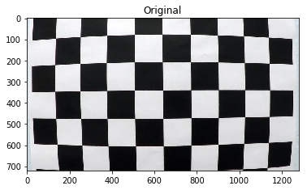
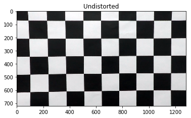
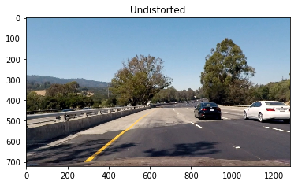
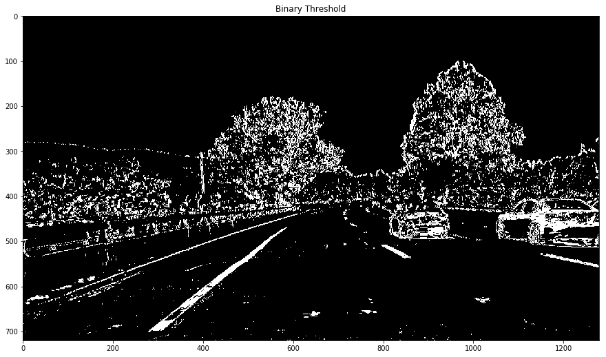
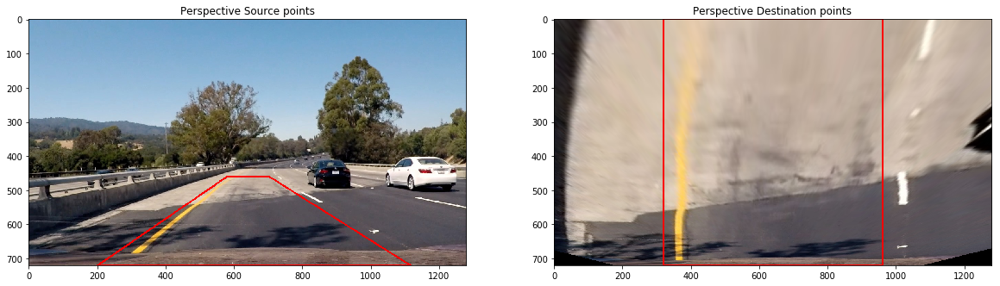
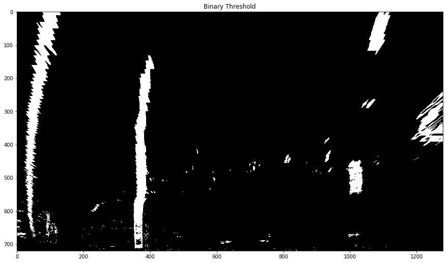
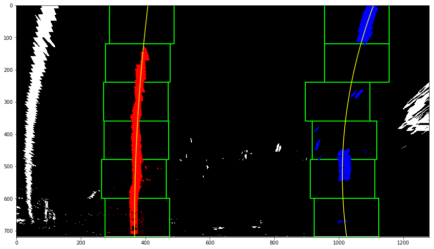
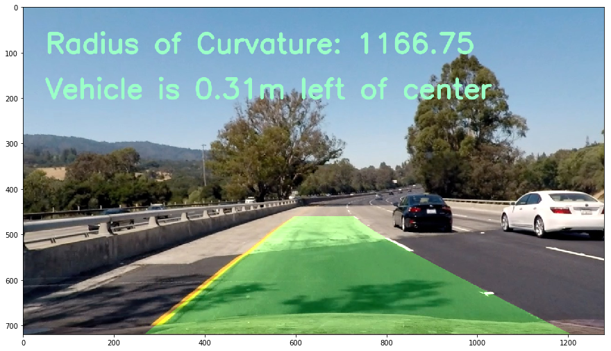

## Advanced Lane Finding

---

The goals / steps of this project are the following:

* Compute the camera calibration matrix and distortion coefficients given a set of chessboard images.
* Apply a distortion correction to raw images.
* Use color transforms, gradients, etc., to create a thresholded binary image.
* Apply a perspective transform to rectify binary image ("birds-eye view").
* Detect lane pixels and fit to find the lane boundary.
* Determine the curvature of the lane and vehicle position with respect to center.
* Warp the detected lane boundaries back onto the original image.
* Output visual display of the lane boundaries and numerical estimation of lane curvature and vehicle position.

---
###Camera Calibration

I start by defining function <B>calibrate_camera</B> where I prepare "object points", which will be the (x, y, z) coordinates of the chessboard corners in the world. Here I am assuming the chessboard is fixed on the (6, 9) plane at z=0, such that the object points are the same for each calibration image. Thus, objp is just a replicated array of coordinates, and objpoints will be appended with a copy of it every time I successfully detect all chessboard corners in a test image. imgpoints will be appended with the (x, y) pixel position of each of the corners in the image plane with each successful chessboard detection.

I then used the output objpoints and imgpoints to undistort the image inside the function <b>undistort_image</b>. In this fucntion I first compute the camera calibration and distortion coefficients using the cv2.calibrateCamera() function. I applied this distortion correction to the test image using the cv2.undistort() function and obtained this result

###Pipeline (test_images)

####1. Undistorting image
Using the same function mentioned earlier, <b>undistort_image</b>, I first undistort the test image.

####2. Binary threshold of image
I have defined function <b>color_threshold</b> to find binary threshold of my input image. First I convert the image to HLS color space and using thresold values for 'S' channel I calculate s_binary. Then using SobelX gradients I find gradient binary image sxbinary. Finally I combine these two binary images by adding the two and I get below image:

####3. Transform Perspective of image
I defined function <b>transform_perspective</b> to transform perspective of my previous binary warped image. The source and destination polygon points are as below:

    src = np.array(
        [[(img_size[1] / 2) - 60, img_size[0] / 2 + 100],
        [((img_size[1] / 6) - 12), img_size[0]],
        [(img_size[1] * 5 / 6) + 50, img_size[0]],
        [(img_size[1] / 2 + 62), img_size[0] / 2 + 100]], np.float32)
    dst = np.array(
        [[(img_size[1] / 4), 0],
        [(img_size[1] / 4), img_size[0]],
        [(img_size[1] * 3 / 4), img_size[0]],
        [(img_size[1] * 3 / 4), 0]], np.float32)
        
Using these src and dst points, I calculate M = cv2.getPerspectiveTransform(src, dst) and also Minv = cv2.getPerspectiveTransform(dst, src). Finally I warp the image by using cv2.warpPerspective and return the warped image along with the inverse warp coefficients Minv whic will be used later on in <b>transform_inv_perspective</b>.

I also drew polygons for src and dst points to verify my warping function is working fine.

Below is the output of the warped binary image:

####4. Fitting lane lines
In my function <b>fit_lane_lines</b> I used sliding window to first calulate my left and right lane points. Once I had my points, I used np.polyfit to fit a second order polynomial on these points. Below is the output of this function:

I also created function <b>fit_new_lane_lines</b> to fit lines for newer frames in video. Since once a line is calculated we need not do sliding window technique again, but just keep modifying the polynomial coefficients.

####5. Calculate Radius of Curvature and Distance from center.
I defined function <b>get_radius_curvature</b> to calculate radius of curvature. First I fit a new polynomial to the world space instead of image space. I use the pixels to space conversion parameters:
    ym_per_pix = 30/720 # meters per pixel in y dimension
    xm_per_pix = 3.7/700 # meters per pixel in x dimension
Once I have this new polynomial, I used the formula from the lecture to find the curvature of left and right lanes:
    left_curverad = ((1 + (2*left_fit_cr[0]*y_eval*ym_per_pix + left_fit_cr[1])**2)**1.5) / np.absolute(2*left_fit_cr[0])
    right_curverad = ((1 + (2*right_fit_cr[0]*y_eval*ym_per_pix + right_fit_cr[1])**2)**1.5) / np.absolute(2*right_fit_cr[0])

For distance off center, I use function <b>get_off_center_distance</b>. Using image histogram I first get pixel value of left base and right base where we see the lane lines. Then I caluclate the lane center using these values. Image center is half of image shape in x direction. The difference between lane center and image center gives us the off center distance. Then I convert the pixel values to world space by using xm_per_pix = 3.7/700.

Finally in function <b>add_data_to_image</b> I add these two data to the final image. I use average of left and right curvature and print that on the image as below:

###Pipeline (video)
I have uploaded the final video output to my git repository.

###Discussion
I noticed that in the final video, the lane lines are too wobbly when the road texture changes to very bright and reflective. I can thus use better color thresholding algorithm to avoid this and modify the lane lines fitting function too. The radius of curvature too is not very constant in between the frames, I can may be use a better algorithm to determine radius of curvature and also not keep updating it frequently, only after certain number of frames.
