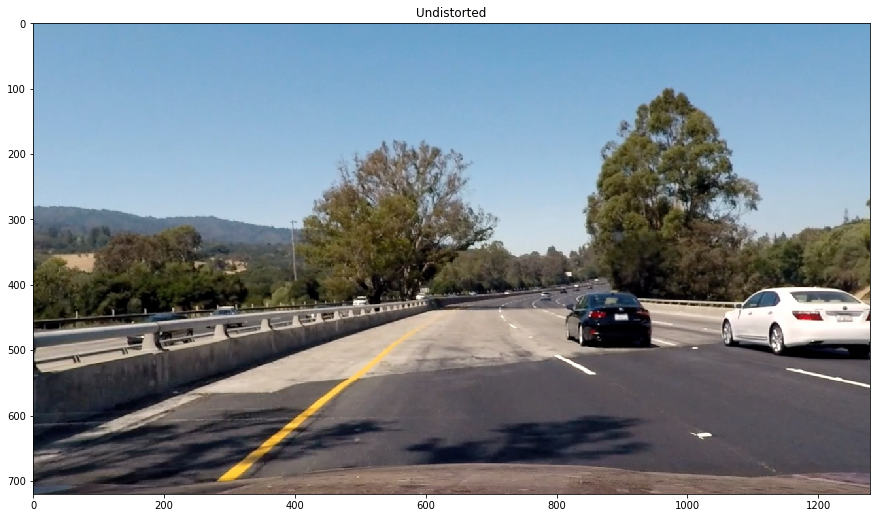

## Advanced Lane Finding

---

The goals / steps of this project are the following:

* Compute the camera calibration matrix and distortion coefficients given a set of chessboard images.
* Apply a distortion correction to raw images.
* Use color transforms, gradients, etc., to create a thresholded binary image.
* Apply a perspective transform to rectify binary image ("birds-eye view").
* Detect lane pixels and fit to find the lane boundary.
* Determine the curvature of the lane and vehicle position with respect to center.
* Warp the detected lane boundaries back onto the original image.
* Output visual display of the lane boundaries and numerical estimation of lane curvature and vehicle position.

---
###Camera Calibration

I start by defining function <B>calibrate_camera</B> where I prepare "object points", which will be the (x, y, z) coordinates of the chessboard corners in the world. Here I am assuming the chessboard is fixed on the (6, 9) plane at z=0, such that the object points are the same for each calibration image. Thus, objp is just a replicated array of coordinates, and objpoints will be appended with a copy of it every time I successfully detect all chessboard corners in a test image. imgpoints will be appended with the (x, y) pixel position of each of the corners in the image plane with each successful chessboard detection.

I then used the output objpoints and imgpoints to undistort the image inside the function <b>undistort_image</b>. In this fucntion I first compute the camera calibration and distortion coefficients using the cv2.calibrateCamera() function. I applied this distortion correction to the test image using the cv2.undistort() function and obtained this result

###Pipeline (test_images)

####1. Undistorting image
Using the same function mentioned earlier, <b>undistort_image</b>, I first undistort the test image.

####2. Binary threshold of image
I have defined function <b>color_threshold</b> to find binary threshold of my input image. First I convert the image to HLS color space and using thresold values for 'S' channel I calculate s_binary. Then using SobelX gradients I find gradient binary image sxbinary. Finally I combine these two binary images by adding the two and I get below image:

####3. Transform Perspective of image
I defined function <b>transform_perspective</b> to transform perspective of my previous binary warped image. The source and destination polygon points are as below:

    src = np.array(
        [[(img_size[1] / 2) - 60, img_size[0] / 2 + 100],
        [((img_size[1] / 6) - 12), img_size[0]],
        [(img_size[1] * 5 / 6) + 50, img_size[0]],
        [(img_size[1] / 2 + 62), img_size[0] / 2 + 100]], np.float32)
    dst = np.array(
        [[(img_size[1] / 4), 0],
        [(img_size[1] / 4), img_size[0]],
        [(img_size[1] * 3 / 4), img_size[0]],
        [(img_size[1] * 3 / 4), 0]], np.float32)
        
Using these src and dst points, I calculate M = cv2.getPerspectiveTransform(src, dst) and also Minv = cv2.getPerspectiveTransform(dst, src). Finally I warp the image by using cv2.warpPerspective and return the warped image along with the inverse warp coefficients Minv whic will be used later on in <b>transform_inv_perspective</b>.

I also drew polygons for src and dst points to verify my warping function is working fine.

